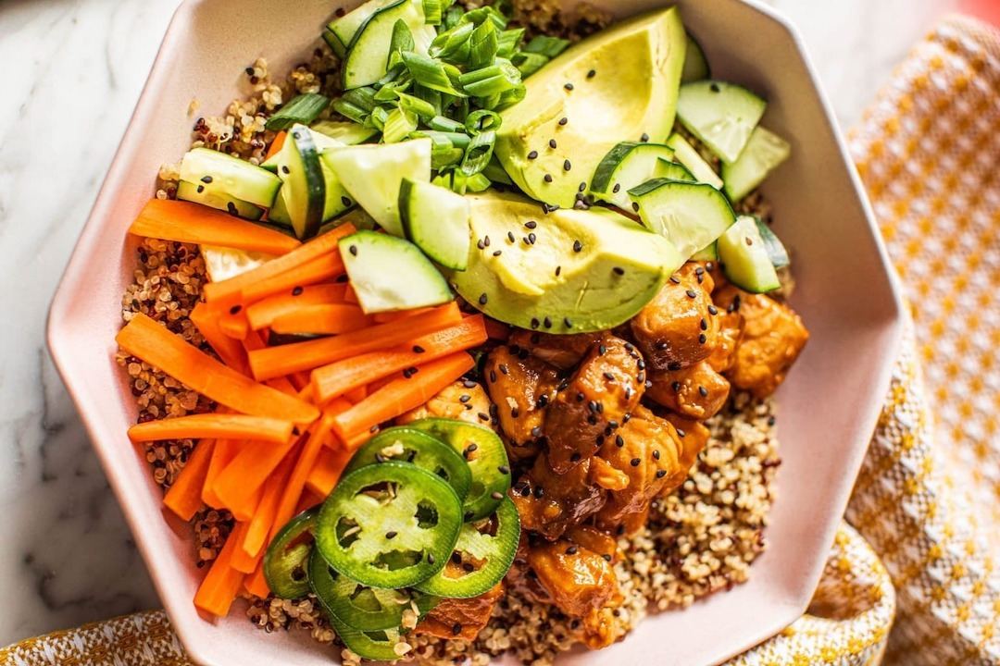

# 🍔 Takeaway - Fresh Food Delivery & Restaurant Booking

A modern, responsive food delivery and restaurant booking website built with Next.js 15, featuring multi-language support (English/Arabic), real-time cart management, and Google Maps integration.



## Features

### 🌐 Multi-Language Support

- **English & Arabic** language support
- RTL (Right-to-Left) layout for Arabic
- Dynamic content switching
- Localized navigation and UI elements

### 🍽️ Food Menu & Ordering

- **Interactive menu** with food categories (Burgers, Pizzas, Pasta, Fries)
- **Real-time cart management** with quantity controls
- **Responsive food cards** with images and descriptions
- **Category filtering** for easy navigation

### 🛒 Shopping Cart & Checkout

- **Persistent cart** across sessions
- **Real-time price calculation**
- **Order summary** with item details
- **Secure checkout process** with delivery information
- **Order confirmation** system

### 📍 Booking System

- **Table reservation** functionality
- **Google Maps integration** for location
- **Date and time selection**
- **Guest count management**
- **Contact information collection**

### 🔍 Search & Navigation

- **Global search modal** for menu items
- **Responsive navigation** with mobile menu
- **Breadcrumb navigation**
- **Smooth page transitions**

### 📱 Responsive Design

- **Mobile-first approach**
- **Cross-device compatibility**
- **Touch-friendly interface**
- **Optimized for all screen sizes**

### ⚡ Performance & SEO

- **Next.js 15** with App Router
- **Optimized images** with Next.js Image component
- **SEO metadata** for all pages
- **Open Graph** and Twitter Card support
- **Sitemap and robots.txt**
- **PWA ready** with manifest.json

## 🚀 Tech Stack

- **Framework:** Next.js 15.3.5
- **Language:** JavaScript (ES6+)
- **Styling:** Tailwind CSS 4
- **State Management:** React Context API
- **Maps:** Google Maps JavaScript API
- **Icons:** React Icons
- **Sliders:** Swiper.js
- **Fonts:** Google Fonts (Creepster, Lobster)

## 📦 Installation

### Prerequisites

- Node.js 18+
- npm or yarn
- Google Maps API Key

### Setup Instructions

1. **Clone the repository**

   ```bash
   git clone https://github.com/yourusername/takeaway.git
   cd takeaway
   ```

2. **Install dependencies**

   ```bash
   npm install
   # or
   yarn install
   ```

3. **Environment Configuration**
   Create a `.env.local` file in the root directory:

   ```env
   NEXT_PUBLIC_GOOGLE_MAPS_API_KEY=your_google_maps_api_key_here
   ```

4. **Run the development server**

   ```bash
   npm run dev
   # or
   yarn dev
   ```

5. **Open your browser**
   Navigate to [http://localhost:3000](http://localhost:3000)

## 🏗️ Project Structure

```
takeaway/
├── app/                    # Next.js App Router pages
│   ├── about/             # About page
│   ├── booking/           # Booking page
│   ├── cart/              # Cart page
│   ├── checkout/          # Checkout page
│   ├── menu/              # Menu page
│   ├── globals.css        # Global styles
│   ├── layout.js          # Root layout with SEO
│   └── page.js            # Home page
├── components/            # React components
│   ├── AboutComp.jsx      # About section component
│   ├── BookingComp.jsx    # Booking form component
│   ├── Button.jsx         # Reusable button component
│   ├── Cart.jsx           # Shopping cart component
│   ├── Discount.jsx       # Discount banner component
│   ├── Footer.jsx         # Footer component
│   ├── Header.jsx         # Navigation header
│   ├── LanguageWrapper.jsx # Language context wrapper
│   ├── Menu.jsx           # Menu display component
│   ├── SearchModal.jsx    # Search functionality
│   └── Slider.jsx         # Hero slider component
├── contexts/              # React Context providers
│   ├── CartContext.jsx    # Shopping cart state
│   ├── LanguageContext.jsx # Language switching
│   └── SearchContext.jsx  # Search modal state
├── data/                  # Static data and translations
│   ├── data.js           # Menu items data
│   └── translations.js   # Multi-language translations
├── public/               # Static assets
│   ├── images/           # Food and UI images
│   ├── manifest.json     # PWA manifest
│   ├── robots.txt        # SEO robots file
│   └── sitemap.xml       # SEO sitemap
└── package.json          # Dependencies and scripts
```

## 🌍 Multi-Language Support

The application supports both English and Arabic languages with:

- **Dynamic content switching** without page reload
- **RTL layout support** for Arabic text
- **Localized navigation** and UI elements
- **Translated food descriptions** and prices
- **Cultural adaptation** for different regions

### Language Switching

Users can switch languages using the language selector in the header, which updates all content dynamically.

## 🍕 Menu Categories

The menu is organized into four main categories:

1. **🍔 Burgers** - Fresh beef and chicken burgers
2. **🍕 Pizzas** - Traditional and specialty pizzas
3. **🍝 Pasta** - Italian pasta dishes
4. **🍟 Fries** - Crispy potato fries

Each item includes:

- High-quality food images
- Bilingual descriptions
- Pricing information
- Add to cart functionality

## 🛒 Shopping Cart Features

- **Real-time updates** when adding/removing items
- **Quantity controls** with increment/decrement buttons
- **Total price calculation** with tax considerations
- **Persistent storage** across browser sessions
- **Clear cart** functionality
- **Proceed to checkout** with order summary

## 📍 Booking System

The booking system includes:

- **Contact information** collection
- **Date and time selection** with validation
- **Guest count** management
- **Google Maps integration** for location
- **Responsive form design**
- **Booking confirmation** system

## 🔧 Configuration

### Google Maps API

To enable the booking system's map functionality:

1. Get a Google Maps API key from [Google Cloud Console](https://console.cloud.google.com/)
2. Enable the Maps JavaScript API
3. Add your API key to `.env.local`

### Customization

- **Colors:** Modify CSS variables in `app/globals.css`
- **Content:** Update data in `data/data.js` and `data/translations.js`
- **Styling:** Customize Tailwind classes throughout components

## 📱 Responsive Design

The application is fully responsive with:

- **Mobile-first** design approach
- **Breakpoint optimization** for tablets and desktops
- **Touch-friendly** interface elements
- **Optimized navigation** for mobile devices
- **Flexible layouts** that adapt to screen sizes

## ⚡ Performance Optimizations

- **Next.js Image optimization** for faster loading
- **Code splitting** for reduced bundle size
- **Lazy loading** for non-critical components
- **Optimized fonts** with Google Fonts
- **Minified CSS** with Tailwind CSS
- **Efficient state management** with Context API

## 🔍 SEO Features

- **Meta tags** for all pages
- **Open Graph** and Twitter Card support
- **Structured data** markup
- **Sitemap generation**
- **Robots.txt** configuration
- **Canonical URLs**
- **Language alternates**

## 🚀 Deployment

### Vercel (Recommended)

1. Connect your GitHub repository to Vercel
2. Add environment variables in Vercel dashboard
3. Deploy automatically on push to main branch

### Other Platforms

The application can be deployed to any platform that supports Next.js:

- Netlify
- AWS Amplify
- DigitalOcean App Platform
- Railway

## 🤝 Contributing

1. Fork the repository
2. Create a feature branch (`git checkout -b feature/amazing-feature`)
3. Commit your changes (`git commit -m 'Add amazing feature'`)
4. Push to the branch (`git push origin feature/amazing-feature`)
5. Open a Pull Request

## Acknowledgments

- **Next.js team** for the amazing framework
- **Tailwind CSS** for the utility-first CSS framework
- **Google Maps** for location services
- **React Icons** for the beautiful icon library
- **Swiper.js** for the smooth slider functionality

**Made with ❤️ by the Takeaway Team**

_Fresh food, delivered to your door._
